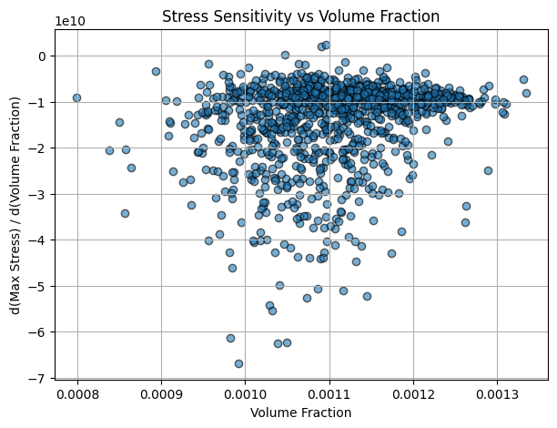
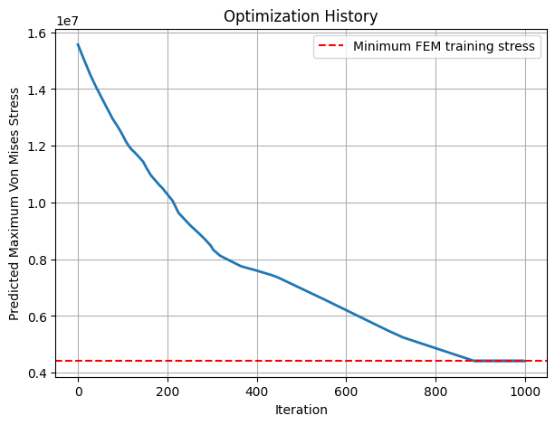
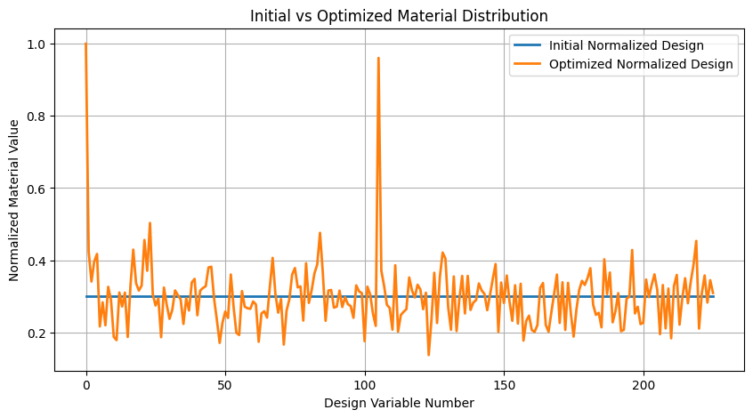
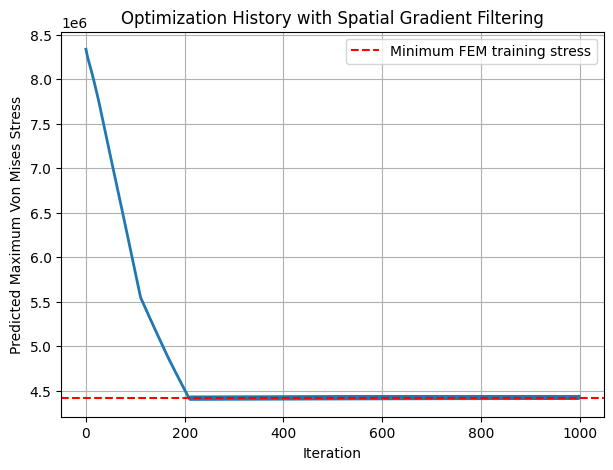
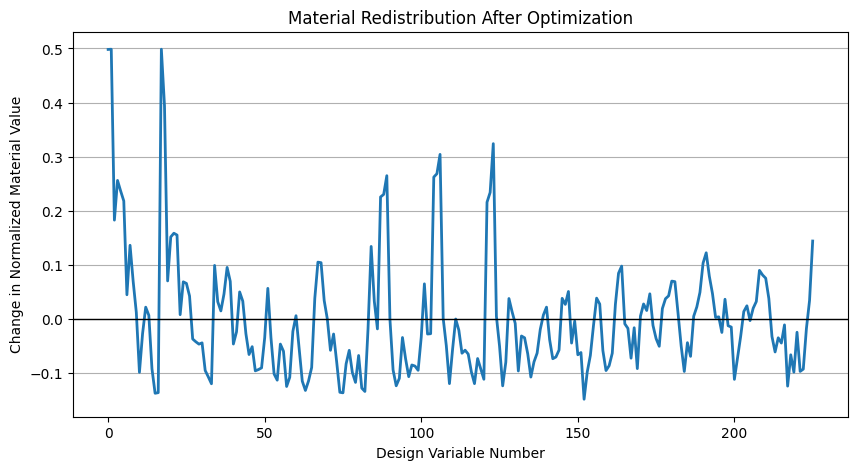
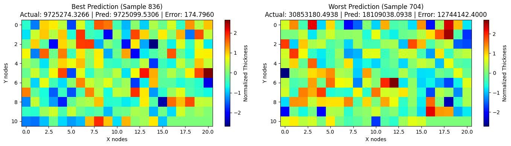
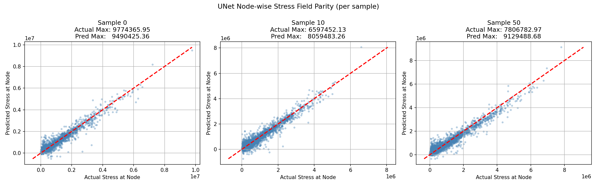

# Lattice Beam Optimization using Deep Learning

A deep learning pipeline for predicting and minimizing peak von Mises stress in lattice cantilever beam structures using neural network surrogates and gradient-based optimization.


---

## Overview

The structure is a 2D cantilever beam made of centered rectangular lattice unit cells, with thickness values assigned at 226 nodes. The goal is to train neural networks on 5,000 FEA-simulated configurations to predict peak von Mises stress  and then use those networks as differentiable surrogates to minimize it through gradient-based optimization, without running any additional FEA solves.

The dataset is not committed to this repository due to size. See `data/README.md` for the expected directory structure.

---

## Notebooks

### `stress_prediction_mlp.ipynb`  MLP Baseline

A standard fully connected network mapping the 226-node thickness vector to scalar peak stress.

| Test R² | Test MAPE |
|---------|-----------|
| 0.73 | 10.18% |

---

### `gradient_computation.ipynb`  Sensitivity via Backpropagation

Uses `GradientTape` on the trained MLP to compute how peak stress changes with each nodal thickness  identifying which design variables matter most.

| Test R² | Test MAPE |
|---------|-----------|
| 0.69 | 12.1% |



---

### `topology_optimization_adam.ipynb`  Optimization with Adam

Treats nodal thicknesses as differentiable variables and minimizes surrogate-predicted stress using Adam, with a smoothness regularizer and volume-fraction constraint.

| Test R² | Test MAPE | Initial Stress | Optimized Stress |
|---------|-----------|----------------|------------------|
| 0.62 | 13.27% | 15,567,858 Pa | 4,418,916 Pa |

 

---

### `topology_optimization_sgd.ipynb`  Optimization with SGD

Same setup as above using SGD. Direct comparison in convergence speed and final stress reduction.

| Test R² | Test MAPE | Stress Reduction |
|---------|-----------|------------------|
| 0.67 | 11.80% | 47.11% |

 

---

### `stress_prediction_cnn.ipynb`  CNN Surrogate

The thickness vector is reshaped into an 11×21 spatial grid and fed into a CNN, allowing the network to pick up on spatial correlations between neighboring nodes.

| Test R² | Test MAPE |
|---------|-----------|
| 0.7639 | 14.01% |



---

### `stress_field_unet.ipynb`  U-Net for Full-Field Prediction

A U-Net encoder-decoder predicts von Mises stress at all 3,304 nodes. Peak stress is extracted as the field maximum. Harder than scalar regression  the network must get every node right, not just the overall maximum.

| | Full Field | Max Stress |
|--|-----------|------------|
| Train R² | 0.68 | 0.71 |
| Test R² | 0.59 | 0.66 |
| Test MAPE |  | 12.75% |



---

## Results Summary

| Method | Task | Test R² | Test MAPE |
|--------|------|---------|-----------|
| MLP | Peak stress | 0.73 | 10.18% |
| CNN | Peak stress | 0.76 | 14.01% |
| U-Net | Full field + peak extraction | 0.66 | 12.75% |
| Adam optimization | Stress minimization | 0.62 | 13.27% |
| SGD optimization | Stress minimization | 0.67 | 11.80% |

---

## Repository Structure

```
stress-surrogate-optimization/
│
├── notebooks/
│   ├── stress_prediction_mlp.ipynb
│   ├── gradient_computation.ipynb
│   ├── topology_optimization_adam.ipynb
│   ├── topology_optimization_sgd.ipynb
│   ├── stress_prediction_cnn.ipynb
│   └── stress_field_unet.ipynb
│
├── results/
├── data/
│   └── README.md
├── requirements.txt
└── README.md
```

---

## Dependencies

```bash
pip install -r requirements.txt
```

```
tensorflow, keras, keras-tuner, numpy, pandas, scikit-learn, matplotlib, scipy, openpyxl
```

---

## Context

Developed as part of **ME-504: Deep Learning in Physical Systems** at IIT Ropar.